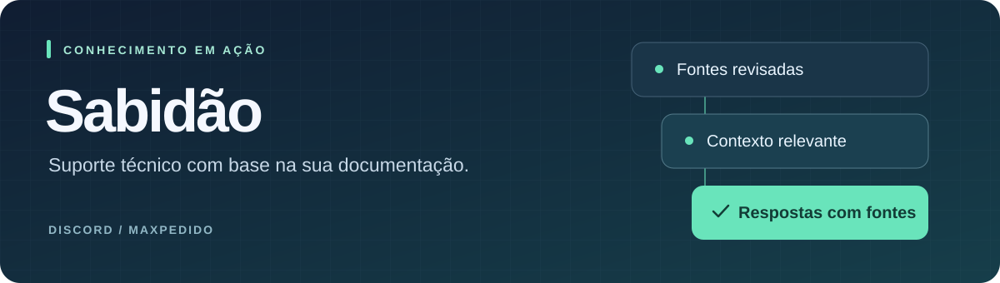

<!-- Apresentação do repositório -->
<p align="center">
  
</p>

# Sabidão

Assistente de suporte técnico para **maxPedido e integrações Máxima**, disponível no Discord e no Microsoft Teams. Consulta documentos, responde com referências às fontes e permite revisar correções para melhorar as próximas respostas.

**Python 3.11** · **PostgreSQL + pgvector** · **Discord e Teams** · **Docker Compose**

[Primeiros passos](docs/primeiros-passos.md) · [Documentação](docs/README.md) · [Arquitetura](docs/arquitetura.md) · [Como contribuir](CONTRIBUTING.md)

## O que o Sabidão oferece

| Recurso | Para que serve |
| --- | --- |
| Consulta à base de conhecimento | Recupera trechos e seções relevantes dos documentos. |
| Respostas com fontes | Identifica os documentos utilizados e aplica verificações de fundamentação. |
| Atendimento em dois canais | Compartilha a mesma lógica de consulta entre Discord e Teams. |
| Correções revisadas | Permite propor, aprovar e publicar ajustes nas respostas. |
| Avaliação de qualidade | Compara respostas com cenários de referência antes de mudanças na operação. |

## Comece por aqui

Clone o repositório e prepare o ambiente no Windows com Python 3.11:

```powershell
git clone https://github.com/vitoradriao/bot-maxima.git
cd bot-maxima
.\setup_maquina.bat
```

O instalador cria o ambiente virtual, instala as dependências e gera o arquivo `.env` quando ele ainda não existe. Preencha as credenciais e siga os [primeiros passos](docs/primeiros-passos.md) para preparar o banco e indexar os documentos.

Para executar os serviços em contêineres, siga o [guia Docker](GUIA_DOCKER.md). Para registrar e instalar o aplicativo no Teams, consulte o [guia do Teams](GUIA_TEAMS.md).

> A configuração de exemplo publicada usa Gemini e vetores de 1536 dimensões. O modelo de embeddings, a dimensão configurada e o esquema do banco precisam ser compatíveis.

## Organização do projeto

| Caminho | Responsabilidade |
| --- | --- |
| `bot.py`, `bot_teams.py` | Entrada dos canais Discord e Teams. |
| `bot_common.py` | Histórico, limites de uso e formatação compartilhada. |
| `rag.py`, `db.py`, `config.py` | Consulta, geração de respostas, acesso ao banco e configuração. |
| `ingest.py` | Leitura, divisão e indexação dos documentos. |
| `docs/` | Documentação do projeto e identidade visual. |
| `scripts/` | Extração, empacotamento e ferramentas de manutenção. |
| `sql/`, `docker/` | Esquemas, migrações e inicialização do banco. |
| `tests/`, `evaluation/` | Testes automatizados e avaliação das respostas. |
| `bootstrap/` | Documento de referência para as regras de negócio. |
| `teams_manifest/` | Modelo do manifesto e ícones do aplicativo Teams. |
| `documentos/` | Fontes de conhecimento utilizadas pelo assistente. |

A documentação de desenvolvimento fica em `docs/`; os conteúdos consultados pelo bot ficam em `documentos/`. Arquivos temporários, logs, cópias de segurança e relatórios gerados são ignorados pelo Git. Arquivos já versionados continuam no histórico, mesmo quando estão em uma pasta ignorada.

## Comandos do Discord

Com o prefixo padrão `!`:

| Comando | Uso |
| --- | --- |
| `!ping` | Verificar se o bot está disponível. |
| `!status` | Consultar o estado da base. |
| `!ajuda` | Listar os comandos disponíveis. |
| `!ask sua pergunta` | Fazer uma pergunta à base de conhecimento. |
| `!fontes` | Listar documentos indexados. |
| `!limpar` | Limpar o histórico da conversa. |

## Próximos passos

- [Preparar o ambiente e iniciar o bot](docs/primeiros-passos.md).
- [Entender o fluxo de uma resposta](docs/arquitetura.md).
- [Atualizar documentos e extrair tickets](docs/operacao.md).
- [Avaliar a qualidade das respostas](evaluation/README.md).
- [Contribuir com o projeto](CONTRIBUTING.md).
