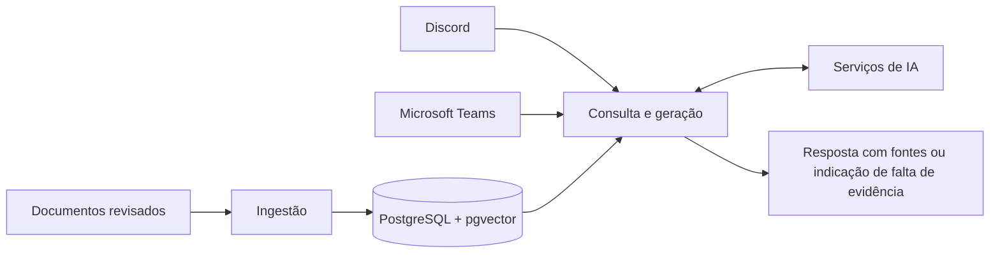

# Arquitetura

[Documentação](README.md) / Arquitetura

O Sabidão é um assistente Python com dois canais de atendimento e uma lógica compartilhada de geração aumentada por recuperação (RAG). O repositório não contém uma interface web independente.

## Componentes

| Arquivo | Responsabilidade |
| --- | --- |
| `bot.py` | Comandos, mensagens e feedback no Discord. |
| `bot_teams.py` | Mensagens e comandos no Teams, além de `/api/messages` e `/api/health`. |
| `bot_common.py` | Histórico das conversas, intervalos de uso e divisão das respostas. |
| `rag.py` | Identificação da intenção, recuperação, reordenação opcional, geração e verificação das respostas. |
| `db.py` | Conexões, consultas e chamadas às funções do banco. |
| `config.py` | Carregamento e validação das variáveis de ambiente. |
| `ingest.py` | Leitura das fontes, criação de seções e trechos, embeddings e indexação. |

## Ciclo da base de conhecimento

1. Revisar os documentos que serão consultados pelo assistente.
2. Indexar os conteúdos com um modelo compatível com o banco.
3. Recuperar trechos relevantes para a pergunta recebida.
4. Gerar a resposta conforme as verificações de evidência configuradas.
5. Revisar correções propostas antes de publicá-las na memória de feedback.
6. Comparar a qualidade das respostas antes de alterar a operação.

Os guias em `docs/` orientam quem mantém o projeto. As fontes em `documentos/` alimentam o assistente. Revise o diretório e as opções de recursão antes de ingerir arquivos para evitar a inclusão de materiais de trabalho e cópias antigas.

## Serviços e persistência

O Compose define PostgreSQL, serviços separados para Discord e Teams e ferramentas de ingestão e geração do pacote Teams. Os serviços de IA são dependências externas dessa composição.

O banco persiste no volume `postgres_data`. Os relatórios de execução ficam em `runtime/`, e os pacotes gerados do Teams ficam em `teams_manifest/build/`.

O perfil publicado usa 1536 dimensões por padrão. Alterações de modelo ou dimensão devem acompanhar o [esquema SQL](../sql/README.md).
